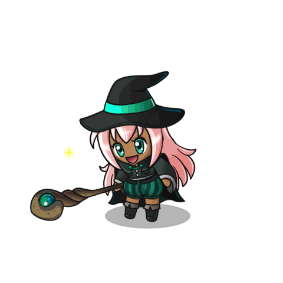

<p align="center"></p> 
<h1 align="center">#ImersaoGameDev<br>  </h1>


## 🔖 Descrição 
🕹️ Criação de um jogo utilizando Javascript na semana da #ImersãoGameDev da Alura.

## 💻 Tecnologias

* HTML5/Canvas
* JavaScript

## 💻 Bibliotecas

* [p5.js](https://p5js.org/)

## ℹ️ Como usar
```bash
# Clone esse repositório
$ git clone https://github.com/brunnosena/ImersaoGameDev.git

# Abra o arquivo
index.html
```

## 🖼 Layout


## 📝 Licença
O projeto se encontra sob licença MIT. Para mais detalhes, acesse [license](LICENSE).

---
---

<h3 align="center">
  made with great affection by 💚💻🖥💚 Brunno Sena
</h3>

<p align="center">
  <a href="https://www.linkedin.com/in/brunnosena">
    
  </a>
  <a href="https://www.facebook.com/brunnosena">
    
  </a>
    <a href="https://www.twitter.com/brunnosena">
    
  </a>
  <a href="https://www.instagram.com/brunnosena/">
    
  </a>
</p>